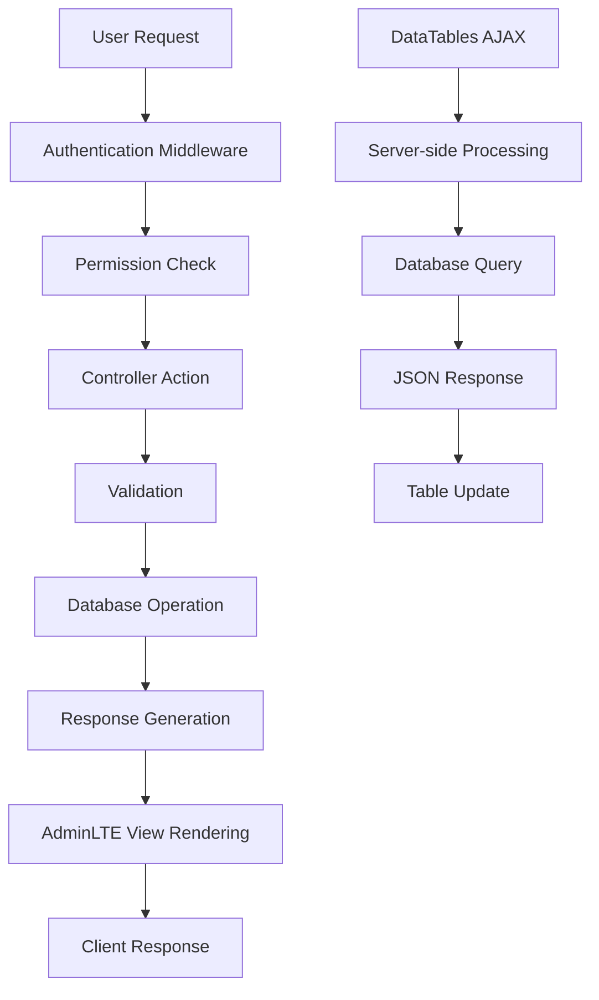

Purpose: Technical reference for understanding system design and development patterns
Last Updated: [Auto-updated by AI]

## Architecture Documentation Guidelines

### Document Purpose

This document describes the CURRENT WORKING STATE of the application architecture. It serves as:

-   Technical reference for understanding how the system currently works
-   Onboarding guide for new developers
-   Design pattern documentation for consistent development
-   Schema and data flow documentation reflecting actual implementation

### What TO Include

-   **Current Technology Stack**: Technologies actually in use
-   **Working Components**: Components that are implemented and functional
-   **Actual Database Schema**: Tables, fields, and relationships as they exist
-   **Implemented Data Flows**: How data actually moves through the system
-   **Working API Endpoints**: Routes that are active and functional
-   **Deployment Patterns**: How the system is actually deployed
-   **Security Measures**: Security implementations that are active

### What NOT to Include

-   **Issues or Bugs**: These belong in `MEMORY.md` with technical debt entries
-   **Limitations or Problems**: Document what IS working, not what isn't
-   **Future Plans**: Enhancement ideas belong in `backlog.md`
-   **Deprecated Features**: Remove outdated information rather than marking as deprecated
-   **Wishlist Items**: Planned features that aren't implemented yet

### Update Guidelines

-   **Reflect Reality**: Always document the actual current state, not intended state
-   **Schema Notes**: When database schema has unused fields, note them factually
-   **Cross-Reference**: Link to other docs when appropriate, but don't duplicate content

### For AI Coding Agents

-   **Investigate Before Updating**: Use codebase search to verify current implementation
-   **Move Issues to Memory**: If you discover problems, document them in `MEMORY.md`
-   **Factual Documentation**: Describe what exists, not what should exist

---

# GENAF Enterprise Management System - Architecture

## Project Overview

A comprehensive enterprise management system for GENAF company covering office supplies, ticket reservations, property/mess management, vehicle administration, and asset inventory tracking. The system provides role-based access control with a professional AdminLTE interface.

## Technology Stack

### Backend

-   **Framework**: Laravel 12 (PHP 8.3+)
-   **Database**: MySQL 8.0+
-   **Authentication**: Laravel Breeze with Spatie Laravel Permission
-   **ORM**: Eloquent ORM
-   **Validation**: Laravel Form Request Validation

### Frontend

-   **UI Framework**: AdminLTE 3.x (Bootstrap 4 based)
-   **Templates**: Blade Templates
-   **JavaScript**: jQuery, DataTables, SweetAlert2, Toastr
-   **Icons**: Font Awesome 5.x
-   **Forms**: Select2 for enhanced dropdowns
-   **Charts**: Chart.js (ready for dashboard implementation)

### Development Tools

-   **Package Manager**: Composer
-   **Version Control**: Git
-   **Testing**: Browser automation with Playwright

## Core Components

### 1. Authentication & Authorization System

-   **Laravel Breeze**: Provides authentication scaffolding
-   **Spatie Laravel Permission**: Role-based access control
-   **Middleware**: Permission-based route protection
-   **Session Management**: Secure session handling

### 2. User Management System

-   **UserController**: Handles user CRUD operations
-   **Role Management**: Complete role creation, editing, deletion
-   **Permission Management**: Granular permission control
-   **Department Assignment**: User department management

### 3. AdminLTE UI Framework

-   **Layout System**: Main layout with sidebar navigation
-   **Component Library**: Cards, tables, forms, modals
-   **Responsive Design**: Mobile-friendly interface
-   **Theme System**: Professional AdminLTE styling

### 4. Office Supplies Management

-   **Supply Master Data**: Supply items with stock tracking
-   **Supply Requests**: Two-level approval workflow (Dept Head → GA Admin)
-   **Stock Transactions**: Incoming/outgoing tracking with source tracking
-   **Supply Fulfillment**: Partial fulfillment with distribution tracking
-   **Department Stock**: Department-based stock allocation and reporting
-   **Departments**: Department management with API sync preparation
-   **Stock Opname**: Physical inventory count with gradual counting support

### 5. Data Management

-   **DataTables Integration**: Server-side processing for large datasets
-   **Search & Filtering**: Advanced search capabilities
-   **Pagination**: Efficient data pagination
-   **Export Capabilities**: Ready for PDF/Excel export

## Database Schema

### Core Tables

#### Users & Authentication

```sql
users
├── id (primary key)
├── name
├── email (unique)
├── email_verified_at
├── password
├── phone
├── department
├── is_active (boolean)
├── created_at
└── updated_at

roles
├── id (primary key)
├── name (unique)
├── guard_name
├── created_at
└── updated_at

permissions
├── id (primary key)
├── name (unique)
├── guard_name
├── created_at
└── updated_at

model_has_roles (Spatie package)
├── role_id
├── model_type
└── model_id

model_has_permissions (Spatie package)
├── permission_id
├── model_type
└── model_id

role_has_permissions (Spatie package)
├── permission_id
└── role_id
```

#### Office Supplies

```sql
supplies
├── id (primary key)
├── code (unique)
├── name
├── category
├── unit
├── current_stock
├── min_stock
├── price (nullable)
├── description
├── is_active (boolean)
├── created_at
└── updated_at

departments
├── id (primary key)
├── department_name (unique)
├── slug (unique)
├── status (boolean)
├── created_at
└── updated_at

supply_requests
├── id (primary key)
├── employee_id (foreign key)
├── department_id (foreign key)
├── request_date
├── status (pending_dept_head, pending_ga_admin, approved, rejected, partially_fulfilled, fulfilled)
├── department_head_approved_by
├── department_head_approved_at
├── ga_admin_approved_by
├── ga_admin_approved_at
├── notes
├── created_at
└── updated_at

supply_request_items
├── id (primary key)
├── request_id (foreign key)
├── supply_id (foreign key)
├── quantity
├── approved_quantity
├── fulfilled_quantity
├── fulfillment_status (pending, partially_fulfilled, completed)
├── created_at
└── updated_at

supply_transactions
├── id (primary key)
├── supply_id (foreign key)
├── type (in, out)
├── source (sap, manual)
├── supplier_name (nullable)
├── purchase_order_no (nullable)
├── department_id (nullable, foreign key)
├── quantity
├── reference_no
├── transaction_date
├── notes
├── user_id (foreign key)
├── created_at
└── updated_at

supply_distributions
├── id (primary key)
├── supply_id (foreign key)
├── department_id (foreign key)
├── request_item_id (foreign key)
├── quantity
├── distribution_date
├── distributed_by (foreign key)
├── notes
├── created_at
└── updated_at

stock_opname_sessions
├── id (primary key)
├── session_code (unique)
├── title
├── description
├── type (manual, scheduled)
├── schedule_type (monthly, quarterly, yearly, nullable)
├── status (draft, in_progress, completed, approved, cancelled)
├── started_at
├── completed_at
├── approved_at
├── created_by (foreign key)
├── approved_by (foreign key)
├── total_items
├── counted_items
├── items_with_variance
├── total_variance_value
├── notes
├── created_at
└── updated_at

stock_opname_items
├── id (primary key)
├── session_id (foreign key)
├── supply_id (foreign key)
├── system_stock
├── actual_count (nullable)
├── variance (calculated)
├── variance_value (calculated)
├── status (pending, counting, counted, verified)
├── reason_code (damaged, expired, lost, found, miscount, other)
├── reason_notes
├── photo_path
├── location_verified (boolean)
├── counted_by (foreign key)
├── counted_at
├── verified_by (foreign key)
├── verified_at
├── created_at
└── updated_at

stock_adjustments
├── id (primary key)
├── session_id (foreign key)
├── supply_id (foreign key)
├── adjustment_type (increase, decrease)
├── quantity
├── old_stock
├── new_stock
├── reason_code
├── reason_notes
├── transaction_id (foreign key)
├── adjusted_by (foreign key)
├── adjusted_at
├── created_at
└── updated_at
```

### Permission System

The system includes 58 comprehensive permissions covering:

-   User Management (5 permissions)
-   Role Management (4 permissions)
-   Permission Management (4 permissions)
-   Office Supplies (8 permissions)
-   Ticket Reservations (5 permissions)
-   Property Management (8 permissions)
-   Vehicle Administration (10 permissions)
-   Asset Inventory (10 permissions)
-   Reports (2 permissions)
-   System Settings (2 permissions)

## API Design

### Web Routes Structure

```php
// Authentication Routes (Laravel Breeze)
Route::get('/dashboard', [DashboardController::class, 'index'])->middleware(['auth', 'verified']);

// User Management
Route::resource('users', UserController::class)->middleware('auth');

// Admin Routes
Route::prefix('admin')->middleware('auth')->group(function () {
    Route::resource('roles', RoleController::class);
    Route::resource('permissions', PermissionController::class);
});
```

### Controller Pattern

All controllers follow Laravel conventions:

-   **Resource Controllers**: Standard CRUD operations
-   **Permission Checks**: `@can` directives in views, middleware in controllers
-   **Validation**: Form Request classes for input validation
-   **Response Handling**: Redirect with success/error messages

## Data Flow



## Security Implementation

### Authentication

-   **Laravel Breeze**: Secure authentication scaffolding
-   **Password Hashing**: bcrypt password hashing
-   **Session Security**: Secure session configuration
-   **CSRF Protection**: All forms protected against CSRF attacks

### Authorization

-   **Role-Based Access Control**: Spatie Laravel Permission package
-   **Permission Checks**: Middleware and Blade directives
-   **Route Protection**: Permission-based route access
-   **View Security**: `@can` directives control UI elements

### Input Validation

-   **Form Requests**: Dedicated validation classes
-   **Database Validation**: Unique constraints and foreign keys
-   **XSS Protection**: Blade template escaping
-   **SQL Injection Prevention**: Eloquent ORM parameterized queries

## AdminLTE Integration

### Layout Structure

```
resources/views/layouts/
├── main.blade.php          # Main application layout
├── auth.blade.php          # Authentication layout
└── partials/
    ├── head.blade.php      # CSS and meta tags
    ├── navbar.blade.php    # Top navigation
    ├── sidebar.blade.php   # Left sidebar navigation
    ├── breadcrumb.blade.php # Breadcrumb navigation
    ├── footer.blade.php    # Footer
    └── scripts.blade.php   # JavaScript includes
```

### Component Usage

-   **Cards**: Primary content containers with headers and tools
-   **DataTables**: Server-side processing with search, sort, pagination
-   **Forms**: Bootstrap 4 form controls with validation
-   **Modals**: SweetAlert2 for confirmations
-   **Notifications**: Toastr for success/error messages
-   **Navigation**: Collapsible sidebar with permission-based menu items

### Styling System

-   **Color Scheme**: AdminLTE default colors (primary blue, success green, warning orange, danger red)
-   **Typography**: Clean, readable fonts with proper hierarchy
-   **Icons**: Font Awesome icons throughout
-   **Responsive**: Mobile-friendly design with Bootstrap 4 grid

## Deployment

### Development Environment

-   **Local Server**: Laravel development server (`php artisan serve`)
-   **Database**: MySQL 8.0+ with migrations and seeders
-   **Assets**: AdminLTE assets served from `public/adminlte/`
-   **Testing**: Browser automation testing with Playwright

### Production Considerations

-   **Web Server**: Apache/Nginx with PHP-FPM
-   **Database**: MySQL 8.0+ with proper indexing
-   **Caching**: Laravel caching for improved performance
-   **Security**: HTTPS, secure headers, environment variables
-   **Monitoring**: Laravel logging and error tracking

## Current Implementation Status

### ✅ Completed Modules

-   **Module 1**: Users, Roles & Permissions Management (100% complete)

    -   User CRUD with DataTables
    -   Role Management (CRUD)
    -   Permission Management (CRUD)
    -   AdminLTE professional UI
    -   Comprehensive testing

-   **Module 2**: Office Supplies Management (95% complete)
    -   Supply Master Data (CRUD operations)
    -   Supply Requests with Two-Level Approval (Department Head → GA Admin)
    -   Stock Transactions (incoming/outgoing tracking)
    -   Supply Fulfillment System with partial fulfillment
    -   Department Stock Allocation and Reporting
    -   Departments Management with API sync preparation
    -   Stock Opname Module (Physical Inventory Count) - 95% complete

### 🚧 Next Modules

-   **Module 3**: Ticket Reservation Management
-   **Module 4**: Property Management System
-   **Module 5**: Vehicle Administration
-   **Module 6**: Asset Inventory Management
-   **Module 7**: Dashboard & Reporting

## Development Patterns

### Standard List Page Pattern

```php
@extends('layouts.main')
@section('content')
<div class="card">
    <div class="card-header">
        <h3 class="card-title">Title</h3>
        <div class="card-tools">
            @can('create resource')
                <a href="{{ route('resource.create') }}" class="btn btn-primary btn-sm">
                    <i class="fas fa-plus"></i> Add New
                </a>
            @endcan
        </div>
    </div>
    <div class="card-body">
        <table id="dataTable" class="table table-bordered table-striped">
            <!-- DataTable content -->
        </table>
    </div>
</div>
@endsection
```

### Standard Form Page Pattern

```php
@extends('layouts.main')
@section('content')
<div class="card">
    <div class="card-header">
        <h3 class="card-title">Form Title</h3>
    </div>
    <form action="{{ route('resource.store') }}" method="POST">
        @csrf
        <div class="card-body">
            <!-- Form fields with validation -->
        </div>
        <div class="card-footer">
            <button type="submit" class="btn btn-primary">Save</button>
            <a href="{{ route('resource.index') }}" class="btn btn-secondary">Cancel</a>
        </div>
    </form>
</div>
@endsection
```

### DataTables Integration Pattern

```javascript
$('#dataTable').DataTable({
    processing: true,
    serverSide: true,
    ajax: '{{ route('resource.index') }}',
    columns: [
        { data: 'id', name: 'id' },
        { data: 'name', name: 'name' },
        { data: 'actions', name: 'actions', orderable: false, searchable: false }
    ]
});
```
